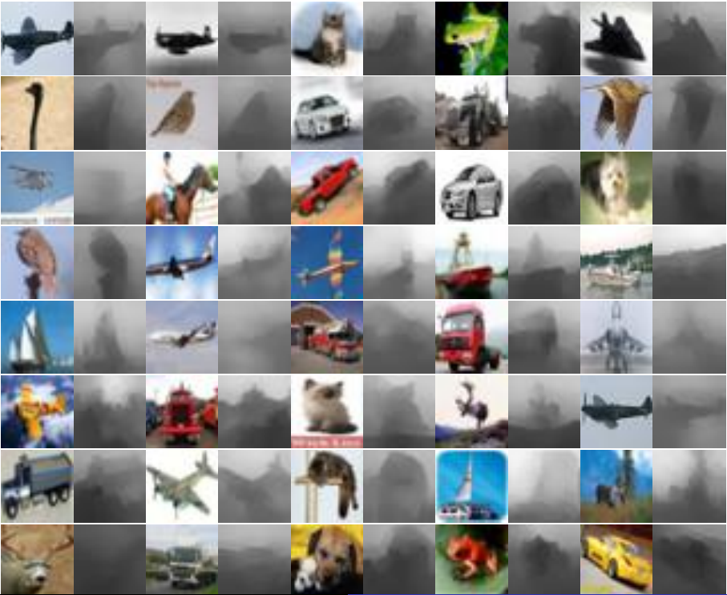

# Estimated Depth Map Helps Image Classification
*Yihui He, Xi'an Jiaotong University*

 | 
:---:|:---:
RGBD dataset | estimated depth classification

### how to test
1. you can run tryhere.ipynb to test performance on RGBD and RGB images.
2. you can do depth estimation in train/ folder  

### Approach  
1. train a mapping map RGB to depth
2. convert cifar10 to images  
3. convert RGBD to cifar10 format  
4. train neural network on RGBD dataset

### download  
[dcnf-fcsp](https://bitbucket.org/fayao/dcnf-fcsp)  
[RGBD CIFAR-10](https://github.com/yihui-he/Estimated-Depth-Map-Helps-Image-Classification/releases/tag/depth-cifar-10)  

### External Links  
[all dataset descriptions](http://www0.cs.ucl.ac.uk/staff/M.Firman/RGBDdatasets/)  
[a good one](http://redwood-data.org/3dscan/index.html)  
